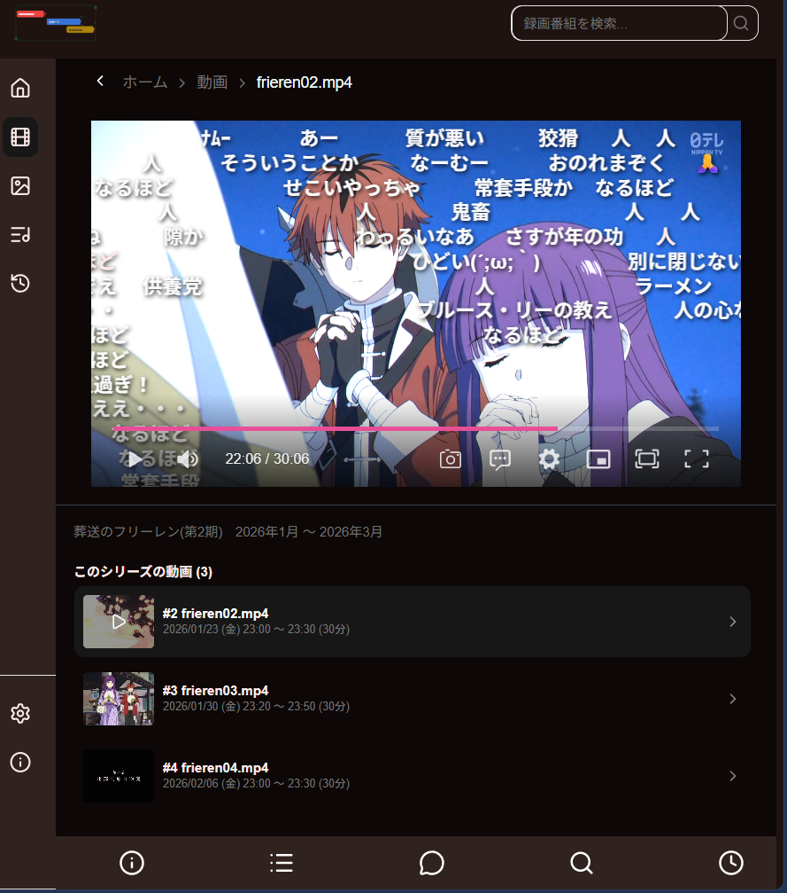
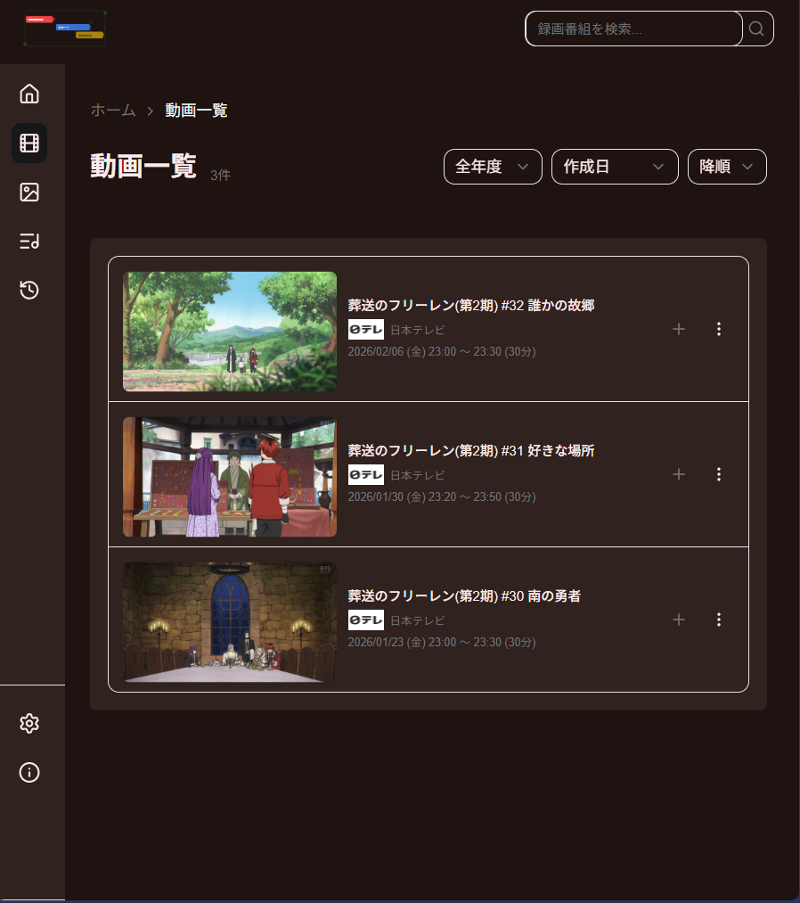
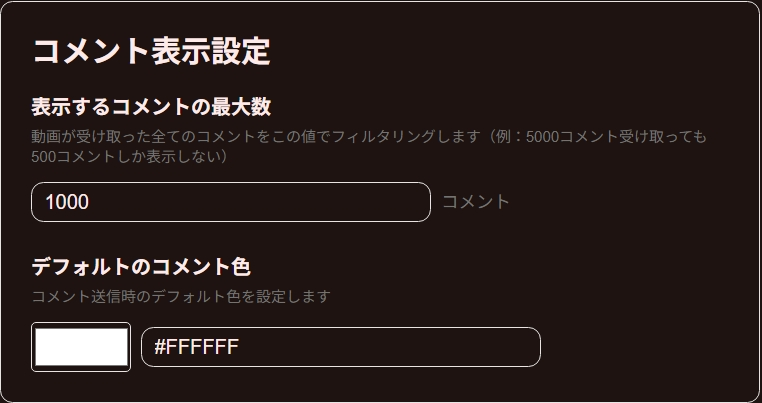
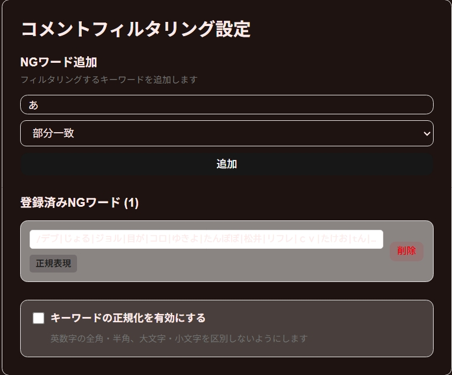
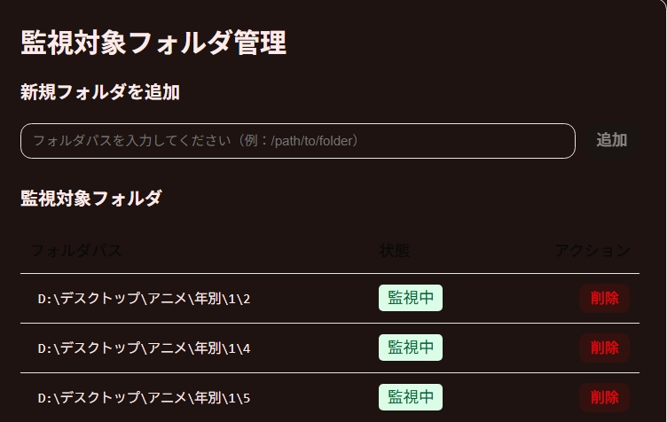
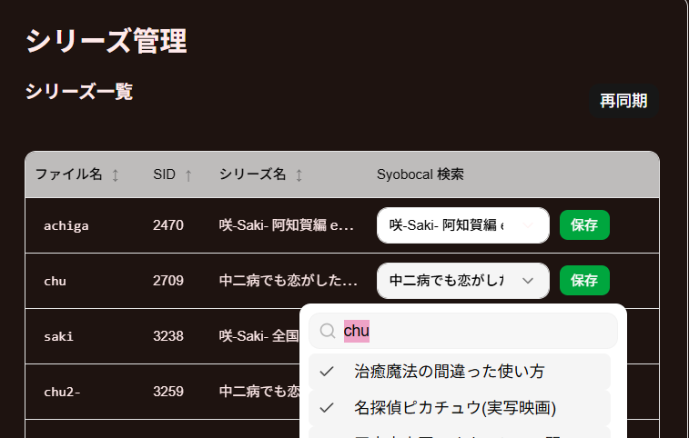

# CommentPlayer

ローカルにある動画をブラウザ上でコメント付きで再生できるアプリケーションです。外部API を利用して過去ログコメントや動画メタデータを取得し、快適な視聴体験を提供します。以前作成した[動画アプリ](https://github.com/hogecode/video-app)の後継的な位置づけです。



## 目次

- [概要](#概要)
- [主な機能](#主な機能)
- [動作環境](#動作環境)
- [事前準備](#事前準備)
- [インストール・セットアップ](#インストール・セットアップ)
- [使用手順](#使用手順)
- [設定方法](#設定方法)
- [技術スタック](#技術スタック)
- [参考プロジェクト](#参考プロジェクト)
- [利用API](#利用api)

## 概要

CommentPlayer は、ローカルに保存されている動画ファイルをブラウザ上で再生し、リアルタイムでコメント（弾幕）を表示するアプリケーションです。ニコニコ実況の過去ログやしょぼいカレンダーなどの外部API を活用して、動画に関連するメタデータやコメント情報を自動取得できます。

## 主な機能

### 📺 一覧画面
- **動画検索**: タイトル部分一致検索で動画検索
- **年でフィルタリング**: 放送された都市で動画をフィルタリング
- **動画ソート**: ファイル名、放送日を昇順、降順でソート
- **マイリスト機能**: お気に入り動画の管理
- **視聴履歴**: 視聴した動画の履歴管理
- **サムネイル機能**: 動画のサムネイル表示と再生成
- **動画ダウンロード機能**: ローカルへの動画保存



### 🎬 視聴画面
- **スクリーンショット機能**: 特定のタイミングでキャプチャ撮影、キャプチャ一覧で確認可能
- **コメント表示制御**: コメント（弾幕）の表示・非表示切り替え
- **メタデータ表示**: 外部API から取得した動画の詳細情報を表示
- **シリーズ再生**: シリーズ内の複数動画を連続再生
- **コメント管理**:
  - コメントリスト表示
  - コメント検索機能
  - コメント遅延設定
  - A・B・C位置への自動シーク機能
- **コメント表示カスタマイズ**: 最大表示数・色・NG キーワード設定

### ⚙️ 設定画面
- **フォルダ監視**: 監視対象フォルダの追加・削除、リアルタイムでDB と同期
- **コメント表示設定**: 最大コメント数、色、NG キーワード機能
- **シリーズ管理**: 外部API を利用して動画ファイル名とタイトルを自動対応




### ⚙️ ユーザー登録、ログイン画面
- **設定同期機能**: 視聴履歴、コメント設定等のローカルの設定を複数のデバイスで同期


## 動作環境

| 項目 | 要件 |
|------|------|
| OS | Windows （PowerShell コマンド使用のため） |
| Docker | Docker Desktop （コンテナ化は開発中） |

> **注**: Makefile で PowerShell コマンドを使用しており、パス設定の関係上現在はWindows 限定です。

## 事前準備

以下のツールを Winget でインストールしてください：

```powershell
winget install FFmpeg
winget install ffprobe
winget install Docker.DockerDesktop
winget install Caddy
winget install openssl
```

## インストール・セットアップ

### 1. リポジトリをクローン

```bash
git clone https://github.com/hogecode/CommentPlayer.git
cd CommentPlayer
```

### 2. 設定ファイルの準備

```bash
# サーバー設定ファイルのコピー
cp server/config.yaml.example server/config.yaml

# フロントエンド設定ファイルのコピー
cp apps/web/.env.local.example apps/web/.env.local
```

### 3. config.yaml の編集

`server/config.yaml` を開き、以下の項目を設定します：

```yaml
# ================================
# サーバー設定
# ================================

server:
  host: "0.0.0.0"                          # Tailscale 使用時はそのIP を指定
  port: 8000
  jwt_secret: "your_jwt_secret_key_here"   # 後述の手順で生成
  schemes: "http"                          # Caddy 使用時は "https"

# ================================
# スクリーンショット保存先
# ================================

storage:
  captures_dir: "C:\\Users\\user\\Pictures\\Screenshots"

# ================================
# 動画ファイル名パターン
# (このパターンを使用してシリーズを抽出します。)
# ================================

series:
  patterns:
    - "{title}{episode}"      # 例: frielen01.mp4
    - "{title}-{episode}"     # 例: frielen2-01.mp4
    # パターンは必要に応じて追加してください
```

### 4. JWT シークレットの生成

OpenSSL を使用して安全なシークレットキーを生成します：

```powershell
# OpenSSL がインストールされている場合
openssl rand -base64 32
```

生成されたキーを `config.yaml` の `jwt_secret` に設定してください。

## 使用手順

### 基本的な使い方

#### 1. 開発サーバーの起動

```bash
make server-dev
```

#### 2. ブラウザでアクセス

デフォルトでは以下のURLでアクセスできます：

```
http://localhost:8000
```

#### 3. フォルダ監視の設定

設定画面（⚙️）から以下の操作を行います：

1. **フォルダ管理**: 監視対象のフォルダを追加
   - ローカルの動画フォルダを指定
   - リアルタイムで DB に同期されます



2. **シリーズ管理**（オプション）:
   - ファイル名とシリーズ名のマッピングを設定
   - 外部API が動画を自動認識します



#### 4. 動画の再生

一覧画面で目的の動画を選択して再生します。

### 他のアクセス方法

#### Tailscale を使用する場合

1. `config.yaml` を編集：

```yaml
server:
  host: "100.x.x.x"  # Tailscale のIP アドレス
```

2. フロントエンド設定 (`apps/web/.env.local`) を編集
3. `make generate-all-win`でAPI設定を更新
4. `make web-build`でフロントを再ビルド
5. `make server-dev`コマンドで起動
6. アクセスURL: `http://{tailscale-ip}:8000`

#### Caddy でHTTPS を使用する場合

1. `config.yaml` を編集：

```yaml
server:
  schemes: "https"
```

2. フロントエンド設定を編集
3. `make generate-all-win`でAPI設定を更新
4. `make web-build`でフロントを再ビルド
5. `make server-dev`コマンドで起動
6. アクセスURL: `https://localhost`

#### DNS masq でローカルドメインを使用する場合

1. DNS masq を設定
2. `make generate-all-win`でAPI設定を更新
3. `make web-build`でフロントを再ビルド
4. `make server-dev`コマンドで起動
5. アクセスURL: `https://app.local`

詳細は [DNS_SETUP.md](dns/DNS_SETUP.md) を参照してください。


## 技術スタック

### フロントエンド

| 技術 | 用途 |
|------|------|
| **React(TypeScript)**  | UI フレームワーク |
| **Vite** | ビルドツール・開発サーバー |
| **TanStack Router** | ルーティング |
| **shadcn-ui + Tailwind CSS** | UI コンポーネント・スタイリング |
| **Axios + TanStack Query** | API 通信・キャッシング |
| **Zustand** | 状態管理 |
| **Zod + React Hook Form** | フォーム検証・管理 |
| **TanStack Virtual, Table** | 仮想リスト・テーブル表示 |

### バックエンド

| 技術 | 用途 |
|------|------|
| **Go** | バックエンド言語 |
| **Gin** | Web フレームワーク |
| **OpenAPI** | API 仕様・ドキュメント |
| **GORM** | ORM |
| **SQLite** | データベース |
| **Fsnotify** | ファイルシステム監視 |
| **その他** | Validator, Resty, Cobra, Viper |

### インフラ・開発環境

- **.devcontainer**: 現在は使用していません
- **Caddy** (オプション): リバースプロキシ・HTTPS
- **DNS masq** (オプション): ローカルDNS
- **Docker Compose** (オプション): コンテナ構成
- **Makefile**: 開発・ビルドコマンド

## 参考プロジェクト

本プロジェクトは以下のプロジェクトを参考にさせていただきました：

- **[KonomiTV](https://github.com/tsukumijima/KonomiTV)** - DTV 視聴アプリケーション
- **[DPlayer](https://github.com/tsukumijima/DPlayer)** - TypeScript 製弾幕（コメント）表示ライブラリ
- **[Commeon](https://air.fem.jp/commeon/)** - 弾幕表示機能付き動画プレイヤー

## 利用API

以下の外部API を活用しています：

| API | 用途 |
|-----|------|
| [ニコ実過去ログAPI](https://jikkyo.tsukumijima.net/) | ニコニコ実況のコメント・過去ログ取得 |
| [しょぼいカレンダーAPI](http://cal.syoboi.jp/) | 番組情報の取得 |

---

