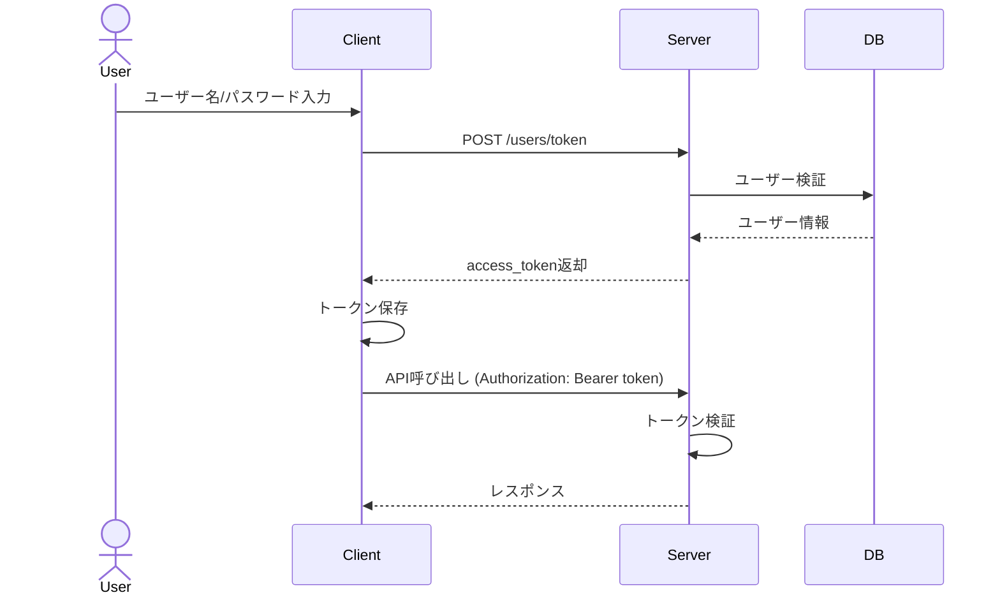

# CommentPlayer REST API 仕様
**バージョン**: 1.0  
**作成日**: 2026年4月9日

---

## 目次

1. [API概要](#api概要)
2. [認証・認可](#認証認可)
3. [エンドポイント一覧](#エンドポイント一覧)
4. [動画関連API](#動画関連api)
5. [ユーザー関連API](#ユーザー関連api)
6. [シリーズ関連API](#シリーズ関連api)
7. [フォルダ関連API](#フォルダ関連api)
8. [キャプチャ関連API](#キャプチャ関連api)
9. [設定関連API](#設定関連api)
10. [エラーハンドリング](#エラーハンドリング)

---

## API概要

### ベースURL
```
http://localhost:8000/api/v1
```

### プロトコル
- HTTP/HTTPS
- リクエスト形式: JSON
- レスポンス形式: JSON
- 文字コード: UTF-8

### ヘッダー

**共通リクエストヘッダー:**
```
Content-Type: application/json
Accept: application/json
Accept-Language: ja-JP (オプション)
```

**認証が必要なエンドポイント:**
```
Authorization: Bearer {access_token}
```

---

## 認証・認可

### JWT認証フロー



### JWTペイロード
```json
{
  "iss": "CommentPlayer",
  "sub": "user_id",
  "iat": 1234567890,
  "exp": 1234654290,
  "user_id": 1,
  "username": "user123",
  "is_admin": false
}
```

---

## エンドポイント一覧

| HTTP | エンドポイント | 説明 | 認証 |
|------|--------------|------|------|
| POST | `/users` | ユーザー登録 | ✗ |
| POST | `/users/token` | トークン取得 | ✗ |
| GET | `/users/me` | 現在のユーザー情報取得 | ✓ |
| PUT | `/users/me` | ユーザー情報更新 | ✓ |
| DELETE | `/users/me` | ユーザー削除 | ✓ |
| GET | `/videos` | 動画一覧取得 | ✗ |
| GET | `/videos/{id}` | 動画詳細取得 | ✗ |
| GET | `/videos/search` | 動画検索 | ✗ |
| GET | `/videos/years` | 年一覧取得 | ✗ |
| POST | `/videos/{id}/thumbnail/regenerate` | サムネイル再生成 | ✓ |
| GET | `/videos/{id}/download` | 動画ダウンロード | ✗ |
| GET | `/series` | シリーズ一覧取得 | ✗ |
| GET | `/series/{id}` | シリーズ詳細取得 | ✗ |
| POST | `/series/resync` | シリーズ再同期 | ✓ |
| GET | `/folders` | フォルダ一覧取得 | ✓ |
| POST | `/folders` | フォルダ追加 | ✓ |
| DELETE | `/folders/{id}` | フォルダ削除 | ✓ |
| GET | `/captures` | キャプチャ一覧取得 | ✓ |
| GET | `/captures/{id}` | キャプチャ詳細取得 | ✓ |
| POST | `/captures` | キャプチャ作成 | ✓ |
| DELETE | `/captures/{id}` | キャプチャ削除 | ✓ |
| GET | `/settings/client` | クライアント設定取得 | ✓ |
| PUT | `/settings/client` | クライアント設定更新 | ✓ |

---

## 動画関連API

### 動画一覧取得

```http
GET /videos?page=1&limit=20&sort=file_name&order=asc&year=2024
```

**クエリパラメータ:**

| パラメータ | 型 | 説明 | デフォルト | 必須 |
|-----------|-----|------|----------|------|
| ids | string | カンマ区切りの動画ID | - | ✗ |
| filterBy | string | フィルタ対象 (year, series) | - | ✗ |
| year | integer | 放送年でフィルタ | - | ✗ |
| page | integer | ページ番号 | 1 | ✗ |
| limit | integer | 1ページあたりの件数 | 20 | ✗ |
| sort | string | ソート対象カラム | file_name | ✗ |
| order | string | asc or desc | asc | ✗ |

**レスポンス (200 OK):**
```json
{
  "data": [
    {
      "id": 1,
      "file_name": "anime_01.mp4",
      "series_id": 5,
      "series": {
        "id": 5,
        "series_name_file": "anime",
        "syobocal_title_name": "アニメタイトル"
      },
      "episode": 1,
      "subtitle": "第1話",
      "duration": 1500.5,
      "views": 10,
      "liked": false,
      "thumbnail_info": {
        "width": 320,
        "height": 180,
        "generated_at": "2024-01-15T10:00:00Z"
      },
      "jikkyo_date": "2024-01-15T00:00:00Z",
      "jikkyo_comment_count": 5000,
      "created_at": "2024-01-15T10:30:00Z"
    }
  ],
  "pagination": {
    "page": 1,
    "limit": 20,
    "total": 150,
    "total_pages": 8
  }
}
```

### 動画詳細取得

```http
GET /videos/{id}
```

**レスポンス (200 OK):**
```json
{
  "id": 1,
  "file_name": "anime_01.mp4",
  "file_path": "/path/to/anime_01.mp4",
  "file_size": 1073741824,
  "series_id": 5,
  "series": {
    "id": 5,
    "series_name_file": "anime",
    "syobocal_title_name": "アニメタイトル",
    "first_year": 2024,
    "first_month": 1
  },
  "episode": 1,
  "subtitle": "第1話",
  "description": "説明文",
  "status": "ready",
  "duration": 1500.5,
  "views": 10,
  "liked": false,
  "jikkyo_date": "2024-01-15T00:00:00Z",
  "jikkyo_comment_count": 5000,
  "channel_id": 1,
  "prog_start_time": "2024-01-15T00:00:00Z",
  "prog_end_time": "2024-01-15T00:30:00Z",
  "thumbnail_info": {
    "width": 320,
    "height": 180,
    "generated_at": "2024-01-15T10:00:00Z"
  },
  "created_at": "2024-01-15T10:30:00Z",
  "updated_at": "2024-01-15T10:30:00Z"
}
```

### 動画検索

```http
GET /videos/search?q=キーワード&page=1&limit=20
```

**クエリパラメータ:**

| パラメータ | 型 | 説明 | 必須 |
|-----------|-----|------|------|
| q | string | 検索キーワード | ✓ |
| page | integer | ページ番号 | ✗ |
| limit | integer | 1ページあたりの件数 | ✗ |

### 年一覧取得

```http
GET /videos/years
```

**レスポンス (200 OK):**
```json
{
  "data": [2024, 2023, 2022, 2021]
}
```

### サムネイル再生成

```http
POST /videos/{id}/thumbnail/regenerate
Authorization: Bearer {token}
```

**リクエストボディ:**
```json
{
  "width": 320,
  "height": 180
}
```

**レスポンス (200 OK):**
```json
{
  "id": 1,
  "thumbnail_info": {
    "width": 320,
    "height": 180,
    "generated_at": "2024-01-15T10:00:00Z"
  }
}
```

---

## ユーザー関連API

### ユーザー登録

```http
POST /users
```

**リクエストボディ:**
```json
{
  "username": "user123",
  "password": "password123"
}
```

**レスポンス (201 Created):**
```json
{
  "id": 1,
  "username": "user123",
  "is_admin": false,
  "created_at": "2024-01-15T10:00:00Z"
}
```

### トークン取得

```http
POST /users/token
```

**リクエストボディ:**
```json
{
  "username": "user123",
  "password": "password123"
}
```

**レスポンス (200 OK):**
```json
{
  "access_token": "eyJhbGciOiJIUzI1NiIsInR5cCI6IkpXVCJ9...",
  "token_type": "Bearer",
  "expires_in": 604800
}
```

### 現在のユーザー情報取得

```http
GET /users/me
Authorization: Bearer {token}
```

**レスポンス (200 OK):**
```json
{
  "id": 1,
  "username": "user123",
  "is_admin": false,
  "client_settings": {
    "mylist": [1, 5, 10],
    "watched_history": [
      {
        "video_id": 1,
        "last_position": 300.5,
        "last_watched_at": "2024-01-15T15:30:00Z"
      }
    ],
    "comment_settings": {
      "max_count": 20,
      "color": "#FF0000",
      "ng_keywords": ["spam"]
    }
  },
  "created_at": "2024-01-15T10:00:00Z",
  "updated_at": "2024-01-15T10:00:00Z"
}
```

---

## シリーズ関連API

### シリーズ一覧取得

```http
GET /series
```

**レスポンス (200 OK):**
```json
{
  "data": [
    {
      "id": 1,
      "series_name_file": "anime",
      "syobocal_title_name": "アニメタイトル",
      "syobocal_title_name_en": "Anime Title",
      "first_year": 2024,
      "first_month": 1,
      "first_end_year": 2024,
      "first_end_month": 3,
      "video_count": 12,
      "created_at": "2024-01-15T10:00:00Z"
    }
  ],
  "total": 50
}
```

### シリーズ詳細取得

```http
GET /series/{id}
```

**レスポンス (200 OK):**
```json
{
  "series": {
    "id": 1,
    "series_name_file": "anime",
    "syobocal_title_name": "アニメタイトル"
  },
  "videos": [
    {
      "id": 1,
      "file_name": "anime_01.mp4",
      "episode": 1,
      "subtitle": "第1話"
    }
  ]
}
```

---

## フォルダ関連API

### フォルダ一覧取得

```http
GET /folders
Authorization: Bearer {token}
```

**レスポンス (200 OK):**
```json
{
  "data": [
    {
      "id": 1,
      "path": "C:\\Videos\\Anime",
      "is_watched": true,
      "created_at": "2024-01-15T10:00:00Z"
    }
  ]
}
```

### フォルダ追加

```http
POST /folders
Authorization: Bearer {token}
```

**リクエストボディ:**
```json
{
  "path": "C:\\Videos\\NewFolder"
}
```

**レスポンス (201 Created):**
```json
{
  "id": 2,
  "path": "C:\\Videos\\NewFolder",
  "is_watched": true,
  "created_at": "2024-01-15T10:00:00Z"
}
```

### フォルダ削除

```http
DELETE /folders/{id}
Authorization: Bearer {token}
```

**レスポンス (200 OK):**
```json
{
  "success": true,
  "message": "フォルダを削除しました"
}
```

---

## キャプチャ関連API

### キャプチャ一覧取得

```http
GET /captures?video_id=1&page=1&limit=20
Authorization: Bearer {token}
```

**レスポンス (200 OK):**
```json
{
  "data": [
    {
      "id": 1,
      "video_id": 1,
      "filename": "capture_001.png",
      "created_at": "2024-01-15T10:00:00Z"
    }
  ],
  "pagination": {
    "page": 1,
    "limit": 20,
    "total": 10
  }
}
```

### キャプチャ作成

```http
POST /captures
Authorization: Bearer {token}
```

**リクエストボディ:**
```json
{
  "video_id": 1
}
```

**レスポンス (201 Created):**
```json
{
  "id": 1,
  "video_id": 1,
  "filename": "capture_001.png",
  "created_at": "2024-01-15T10:00:00Z"
}
```

### キャプチャ削除

```http
DELETE /captures/{id}
Authorization: Bearer {token}
```

**レスポンス (200 OK):**
```json
{
  "success": true,
  "message": "キャプチャを削除しました"
}
```

---

## 設定関連API

### クライアント設定取得

```http
GET /settings/client
Authorization: Bearer {token}
```

**レスポンス (200 OK):**
```json
{
  "mylist": [1, 5, 10],
  "watched_history": [
    {
      "video_id": 1,
      "last_position": 300.5,
      "last_watched_at": "2024-01-15T15:30:00Z"
    }
  ],
  "comment_settings": {
    "max_count": 20,
    "color": "#FF0000",
    "ng_keywords": ["spam", "test"]
  }
}
```

### クライアント設定更新

```http
PUT /settings/client
Authorization: Bearer {token}
```

**リクエストボディ:**
```json
{
  "mylist": [1, 5, 10, 15],
  "comment_settings": {
    "max_count": 30,
    "ng_keywords": ["spam"]
  }
}
```

**レスポンス (200 OK):**
```json
{
  "message": "設定を更新しました"
}
```

---

## エラーハンドリング

### エラーレスポンス形式

```json
{
  "error": "エラーメッセージ",
  "code": "ERROR_CODE",
  "details": {}
}
```

### HTTPステータスコードと対応エラー

| ステータス | コード | 説明 |
|----------|--------|------|
| 400 | INVALID_REQUEST | リクエストが不正 |
| 401 | UNAUTHORIZED | 認証が必要 |
| 403 | FORBIDDEN | アクセス権限がない |
| 404 | NOT_FOUND | リソースが見つからない |
| 409 | CONFLICT | リソースが既に存在する |
| 500 | INTERNAL_ERROR | サーバーエラー |

### エラー例

**ユーザーが見つからない (401 Unauthorized):**
```json
{
  "error": "ユーザー名またはパスワードが正しくありません",
  "code": "UNAUTHORIZED",
  "details": {}
}
```

**リソースが見つからない (404 Not Found):**
```json
{
  "error": "動画が見つかりません",
  "code": "NOT_FOUND",
  "details": {
    "resource": "video",
    "id": 999
  }
}
```

---

**修訂履歴**

| 版 | 日付 | 変更内容 |
|---|------|--------|
| 1.0 | 2026-04-09 | 初版作成 |
