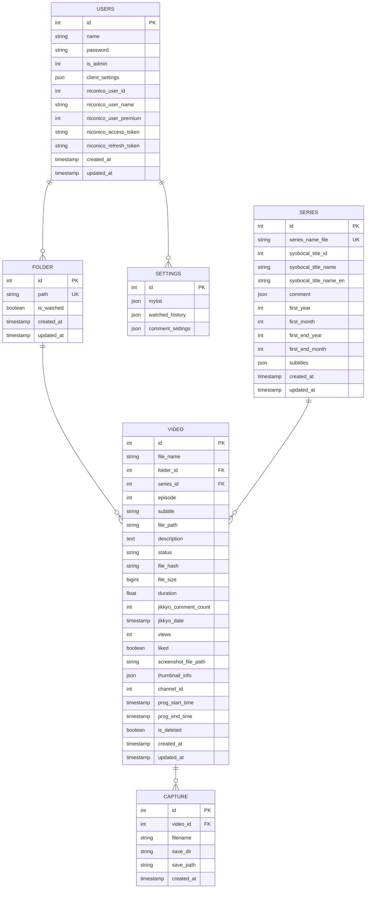

# CommentPlayer データベース設計書

**バージョン**: 1.0  
**作成日**: 2026年4月9日  
**DB**: SQLite

---

## 目次

1. [ER図](#er図)
2. [テーブル仕様](#テーブル仕様)
3. [インデックス](#インデックス)
4. [制約条件](#制約条件)

---

## ER図



---

## テーブル仕様

### USERS テーブル

ユーザーアカウント情報を管理するテーブル。

| カラム | 型 | NOT NULL | デフォルト | 説明 |
|--------|-----|---------|----------|------|
| id | INTEGER | ✓ | AUTO_INCREMENT | プライマリキー |
| name | VARCHAR(255) | ✓ | - | ユーザー名 (ユニーク) |
| password | VARCHAR(255) | ✓ | - | パスワード (BCrypt暗号化) |
| is_admin | INTEGER | ✗ | 0 | 管理者フラグ (0=一般, 1=管理者) |
| client_settings | JSON | ✗ | NULL | クライアント設定 (視聴履歴、マイリスト等) |
| niconico_user_id | INTEGER | ✗ | NULL | ニコニコユーザーID |
| niconico_user_name | VARCHAR(255) | ✗ | NULL | ニコニコユーザー名 |
| niconico_user_premium | INTEGER | ✗ | NULL | プレミアム会員フラグ |
| niconico_access_token | VARCHAR(1024) | ✗ | NULL | ニコニコAPIアクセストークン |
| niconico_refresh_token | VARCHAR(1024) | ✗ | NULL | ニコニコAPIリフレッシュトークン |
| created_at | TIMESTAMP | ✓ | CURRENT_TIMESTAMP | 作成日時 |
| updated_at | TIMESTAMP | ✓ | CURRENT_TIMESTAMP | 更新日時 |

**インデックス:**
- PRIMARY KEY (id)
- UNIQUE (name)

---

### FOLDER テーブル

監視対象フォルダ情報を管理するテーブル。

| カラム | 型 | NOT NULL | デフォルト | 説明 |
|--------|-----|---------|----------|------|
| id | INTEGER | ✓ | AUTO_INCREMENT | プライマリキー |
| path | VARCHAR(1024) | ✓ | - | フォルダパス (ユニーク) |
| is_watched | BOOLEAN | ✗ | TRUE | 監視有効フラグ |
| created_at | TIMESTAMP | ✓ | CURRENT_TIMESTAMP | 作成日時 |
| updated_at | TIMESTAMP | ✓ | CURRENT_TIMESTAMP | 更新日時 |

**インデックス:**
- PRIMARY KEY (id)
- UNIQUE (path)

---

### VIDEO テーブル

動画ファイル情報を管理するテーブル。

| カラム | 型 | NOT NULL | デフォルト | 説明 |
|--------|-----|---------|----------|------|
| id | INTEGER | ✓ | AUTO_INCREMENT | プライマリキー |
| file_name | VARCHAR(512) | ✓ | - | ファイル名 |
| folder_id | INTEGER | ✓ | - | フォルダID (外部キー) |
| series_id | INTEGER | ✗ | NULL | シリーズID (外部キー) |
| episode | INTEGER | ✗ | NULL | エピソード番号 |
| subtitle | VARCHAR(512) | ✗ | NULL | エピソードサブタイトル |
| file_path | VARCHAR(1024) | ✓ | - | ファイルの完全パス |
| description | TEXT | ✗ | NULL | 説明文 |
| status | VARCHAR(32) | ✗ | 'ready' | ステータス (ready/processing/error) |
| file_hash | VARCHAR(64) | ✗ | NULL | ファイルハッシュ (SHA256) |
| file_size | BIGINT | ✗ | NULL | ファイルサイズ (バイト) |
| duration | FLOAT | ✗ | 0.0 | 動画長 (秒) |
| jikkyo_comment_count | INTEGER | ✗ | NULL | ニコニコ実況コメント数 |
| jikkyo_date | TIMESTAMP | ✗ | NULL | 放送日時 |
| views | INTEGER | ✗ | 0 | 再生回数 |
| liked | BOOLEAN | ✗ | FALSE | マイリスト登録フラグ |
| screenshot_file_path | VARCHAR(1024) | ✗ | NULL | スクリーンショット保存パス |
| thumbnail_info | JSON | ✗ | NULL | サムネイル情報 (width, height, generated_at) |
| channel_id | INTEGER | ✗ | NULL | Syobocal チャンネルID |
| prog_start_time | TIMESTAMP | ✗ | NULL | 放送開始時刻 |
| prog_end_time | TIMESTAMP | ✗ | NULL | 放送終了時刻 |
| is_deleted | BOOLEAN | ✗ | FALSE | 論理削除フラグ |
| created_at | TIMESTAMP | ✓ | CURRENT_TIMESTAMP | 作成日時 |
| updated_at | TIMESTAMP | ✓ | CURRENT_TIMESTAMP | 更新日時 |

**インデックス:**
- PRIMARY KEY (id)
- FOREIGN KEY (folder_id) REFERENCES FOLDER(id)
- FOREIGN KEY (series_id) REFERENCES SERIES(id)
- INDEX (file_name)
- INDEX (jikkyo_date)
- INDEX (is_deleted)

---

### SERIES テーブル

シリーズ情報を管理するテーブル。

| カラム | 型 | NOT NULL | デフォルト | 説明 |
|--------|-----|---------|----------|------|
| id | INTEGER | ✓ | AUTO_INCREMENT | プライマリキー |
| series_name_file | VARCHAR(255) | ✓ | - | シリーズ名 (ファイル名から抽出、ユニーク) |
| syobocal_title_id | INTEGER | ✗ | NULL | Syobocal TitleID |
| syobocal_title_name | VARCHAR(512) | ✗ | NULL | Syobocal 日本語タイトル |
| syobocal_title_name_en | VARCHAR(512) | ✗ | NULL | Syobocal 英語タイトル |
| comment | JSON | ✗ | NULL | コメント情報 (構造化データ) |
| first_year | INTEGER | ✗ | NULL | 放送開始年 |
| first_month | INTEGER | ✗ | NULL | 放送開始月 |
| first_end_year | INTEGER | ✗ | NULL | 放送終了年 |
| first_end_month | INTEGER | ✗ | NULL | 放送終了月 |
| subtitles | JSON | ✗ | NULL | サブタイトル一覧 |
| created_at | TIMESTAMP | ✓ | CURRENT_TIMESTAMP | 作成日時 |
| updated_at | TIMESTAMP | ✓ | CURRENT_TIMESTAMP | 更新日時 |

**インデックス:**
- PRIMARY KEY (id)
- UNIQUE (series_name_file)
- INDEX (syobocal_title_id)

---

### CAPTURE テーブル

キャプチャ（スクリーンショット）情報を管理するテーブル。

| カラム | 型 | NOT NULL | デフォルト | 説明 |
|--------|-----|---------|----------|------|
| id | INTEGER | ✓ | AUTO_INCREMENT | プライマリキー |
| video_id | INTEGER | ✓ | - | ビデオID (外部キー) |
| filename | VARCHAR(255) | ✓ | - | キャプチャファイル名 |
| save_dir | VARCHAR(1024) | ✓ | - | 保存ディレクトリ |
| save_path | VARCHAR(1024) | ✓ | - | 完全保存パス |
| created_at | TIMESTAMP | ✓ | CURRENT_TIMESTAMP | 作成日時 |

**インデックス:**
- PRIMARY KEY (id)
- FOREIGN KEY (video_id) REFERENCES VIDEO(id)
- INDEX (video_id)

---

## インデックス

### USERS テーブルのインデックス

```sql
CREATE UNIQUE INDEX idx_users_name ON users(name);
```

### VIDEO テーブルのインデックス

```sql
CREATE INDEX idx_video_folder_id ON video(folder_id);
CREATE INDEX idx_video_series_id ON video(series_id);
CREATE INDEX idx_video_file_name ON video(file_name);
CREATE INDEX idx_video_jikkyo_date ON video(jikkyo_date);
CREATE INDEX idx_video_is_deleted ON video(is_deleted);
CREATE INDEX idx_video_created_at ON video(created_at DESC);
```

### SERIES テーブルのインデックス

```sql
CREATE UNIQUE INDEX idx_series_name_file ON series(series_name_file);
CREATE INDEX idx_series_syobocal_title_id ON series(syobocal_title_id);
```

### CAPTURE テーブルのインデックス

```sql
CREATE INDEX idx_capture_video_id ON capture(video_id);
CREATE INDEX idx_capture_created_at ON capture(created_at DESC);
```

---

## 制約条件

### 外部キー制約

```sql
ALTER TABLE video ADD CONSTRAINT fk_video_folder
  FOREIGN KEY (folder_id) REFERENCES folder(id);

ALTER TABLE video ADD CONSTRAINT fk_video_series
  FOREIGN KEY (series_id) REFERENCES series(id);

ALTER TABLE capture ADD CONSTRAINT fk_capture_video
  FOREIGN KEY (video_id) REFERENCES video(id);
```

### チェック制約

```sql
-- VIDEO テーブル
ALTER TABLE video ADD CHECK (status IN ('ready', 'processing', 'error'));
ALTER TABLE video ADD CHECK (views >= 0);
ALTER TABLE video ADD CHECK (file_size >= 0);
ALTER TABLE video ADD CHECK (duration >= 0);

-- FOLDER テーブル
ALTER TABLE folder ADD CHECK (is_watched IN (0, 1));

-- USERS テーブル
ALTER TABLE users ADD CHECK (is_admin IN (0, 1));
```

---

## データベース初期化

```sql
-- テーブル作成（GORM で自動生成）
-- DROP TABLE IF EXISTS capture;
-- DROP TABLE IF EXISTS video;
-- DROP TABLE IF EXISTS series;
-- DROP TABLE IF EXISTS folder;
-- DROP TABLE IF EXISTS users;

-- シードデータ例
INSERT INTO users (name, password, is_admin) VALUES 
  ('admin', '$2a$12$...', 1),
  ('user1', '$2a$12$...', 0);

INSERT INTO folder (path, is_watched) VALUES 
  ('C:\\Videos\\Anime', 1),
  ('C:\\Videos\\Series', 1);

INSERT INTO series (series_name_file, first_year, first_month) VALUES 
  ('anime1', 2024, 1),
  ('anime2', 2023, 4);
```

---

**修訂履歴**

| 版 | 日付 | 変更内容 |
|---|------|--------|
| 1.0 | 2026-04-09 | 初版作成 |
