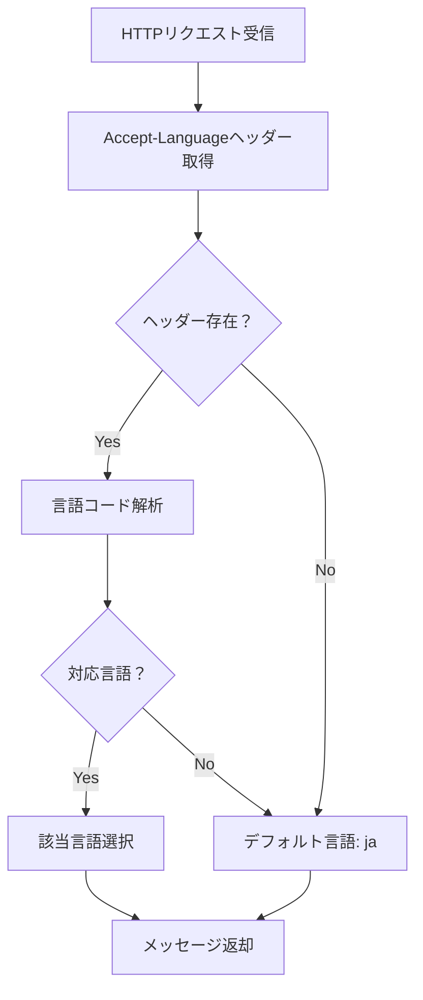

# CommentPlayer 国際化（i18n）仕様書

**バージョン**: 1.0  
**作成日**: 2026年4月9日

---

## 目次

1. [概要](#概要)
2. [対応言語](#対応言語)
3. [メッセージ定義](#メッセージ定義)
4. [ローカライズファイル構成](#ローカライズファイル構成)
5. [バックエンド実装](#バックエンド実装)
6. [フロントエンド実装](#フロントエンド実装)
7. [言語自動判定](#言語自動判定)

---

## 概要

CommentPlayerは、複数言語対応を考慮した設計を採用しています。

- **バックエンド**: Accept-Languageヘッダーに基づいて、エラーメッセージを自動判定・返却
- **フロントエンド**: ブラウザの言語設定に基づいてUI表示を切り替え
- **ローカライズファイル**: TOML形式で管理（メンテナンス性を重視）

---

## 対応言語

| 言語コード | 言語名 | 対応状況 | 優先度 |
|----------|--------|--------|--------|
| ja-JP | 日本語 | ✓ 実装 | 高 |
| en-US | 英語 | 🔄 準備中 | 中 |

### 言語コードの標準化

RFC 5646 に従った言語コード表記を使用：

```
lang-REGION
例) ja-JP, en-US, zh-CN
```

### 正規化ルール

```
Accept-Language: ja-JP,ja;q=0.9
  → 正規化後: ja

Accept-Language: en-US,en;q=0.9
  → 正規化後: en
```

---

## メッセージ定義

### メッセージカテゴリ

メッセージは以下のカテゴリに分類します：

| カテゴリ | 説明 | 例 |
|----------|------|-----|
| errors | エラーメッセージ | `errors.invalid_request` |
| success | 成功メッセージ | `success.thumbnail_regenerated` |
| validation | バリデーションエラー | `validation.password_too_short` |
| info | 情報メッセージ | `info.loading` |

### メッセージキーの命名規則

```
category.scope.message
例)
  errors.auth.invalid_credentials
  validation.video.file_not_found
  success.folder.added
```

---

## ローカライズファイル構成

### ファイル配置

```
server/
├── internal/
│   └── i18n/
│       ├── i18n.go          (i18nロジック)
│       └── locales/
│           ├── ja.toml      (日本語)
│           └── en.toml      (英語)
```

### ファイル形式（TOML）

**server/internal/i18n/locales/ja.toml:**

```toml
[errors]
invalid_request = "リクエストが不正です"
unauthorized = "認証が必要です"
forbidden = "アクセス権限がありません"
not_found = "リソースが見つかりません"
conflict = "リソースが既に存在します"
internal_error = "サーバーエラーが発生しました"

[errors.auth]
invalid_credentials = "ユーザー名またはパスワードが正しくありません"
user_not_found = "ユーザーが見つかりません"
user_already_exists = "ユーザーが既に存在します"
token_invalid = "トークンが無効です"
token_expired = "トークンの有効期限が切れています"

[errors.video]
not_found = "動画が見つかりません"
file_not_found = "ファイルが見つかりません"
invalid_format = "無効なファイル形式です"

[errors.folder]
not_found = "フォルダが見つかりません"
path_invalid = "フォルダパスが無効です"
path_already_exists = "フォルダが既に登録されています"

[errors.validation]
password_too_short = "パスワードは8文字以上で設定してください"
password_mismatch = "パスワードが一致しません"
username_required = "ユーザー名は必須です"
invalid_email = "メールアドレスが無効です"

[errors.thumbnail]
generation_failed = "サムネイル生成に失敗しました"
invalid_size = "サムネイルサイズが無効です"

[errors.capture]
not_found = "キャプチャが見つかりません"
save_failed = "キャプチャの保存に失敗しました"

[success]
user_created = "ユーザーを作成しました"
user_updated = "ユーザー情報を更新しました"
user_deleted = "ユーザーを削除しました"
folder_added = "フォルダを追加しました"
folder_deleted = "フォルダを削除しました"
thumbnail_regenerated = "サムネイルを再生成しました"
settings_updated = "設定を更新しました"
capture_created = "キャプチャを撮影しました"
capture_deleted = "キャプチャを削除しました"

[info]
loading = "読み込み中..."
processing = "処理中..."
syncing = "同期中..."

[validation]
password_too_short = "パスワードは8文字以上で設定してください"
password_mismatch = "パスワードが一致しません"
required_field = "必須項目です"
invalid_format = "形式が無効です"
```

**server/internal/i18n/locales/en.toml:**

```toml
[errors]
invalid_request = "Invalid request"
unauthorized = "Unauthorized"
forbidden = "Access forbidden"
not_found = "Not found"
conflict = "Resource already exists"
internal_error = "Internal server error"

[errors.auth]
invalid_credentials = "Invalid username or password"
user_not_found = "User not found"
user_already_exists = "User already exists"
token_invalid = "Invalid token"
token_expired = "Token has expired"

[errors.video]
not_found = "Video not found"
file_not_found = "File not found"
invalid_format = "Invalid file format"

[errors.folder]
not_found = "Folder not found"
path_invalid = "Invalid folder path"
path_already_exists = "Folder already registered"

[errors.validation]
password_too_short = "Password must be at least 8 characters"
password_mismatch = "Passwords do not match"
username_required = "Username is required"
invalid_email = "Invalid email address"

[errors.thumbnail]
generation_failed = "Failed to generate thumbnail"
invalid_size = "Invalid thumbnail size"

[errors.capture]
not_found = "Capture not found"
save_failed = "Failed to save capture"

[success]
user_created = "User created"
user_updated = "User information updated"
user_deleted = "User deleted"
folder_added = "Folder added"
folder_deleted = "Folder deleted"
thumbnail_regenerated = "Thumbnail regenerated"
settings_updated = "Settings updated"
capture_created = "Capture created"
capture_deleted = "Capture deleted"

[info]
loading = "Loading..."
processing = "Processing..."
syncing = "Syncing..."

[validation]
password_too_short = "Password must be at least 8 characters"
password_mismatch = "Passwords do not match"
required_field = "This field is required"
invalid_format = "Invalid format"
```

---

## バックエンド実装

### i18n パッケージ（Go）

```go
package i18n

import (
    "sync"
    "log/slog"
)

type Messages struct {
    Errors      map[string]string `toml:"errors"`
    Success     map[string]string `toml:"success"`
    Validation  map[string]string `toml:"validation"`
    Info        map[string]string `toml:"info"`
}

var (
    messagesJA Messages
    messagesEN Messages
    currentLocale string = "ja"
    mu sync.RWMutex
)

// Init - i18nを初期化（起動時）
func Init() error {
    if err := loadMessages("ja", &messagesJA); err != nil {
        return err
    }
    if err := loadMessages("en", &messagesEN); err != nil {
        return err
    }
    return nil
}

// T - メッセージを取得（キーの先頭で error/success を判定）
func T(key string) string {
    return TWithLocale(key, currentLocale)
}

// TWithLocale - 指定言語でメッセージを取得
func TWithLocale(key, locale string) string {
    parts := strings.Split(key, ".")
    if len(parts) < 1 {
        return key
    }
    
    msgType := parts[0]
    msgs := selectLocale(locale)
    
    switch msgType {
    case "error":
        return getNestedMessage(msgs.Errors, key)
    case "success":
        return getNestedMessage(msgs.Success, key)
    case "validation":
        return getNestedMessage(msgs.Validation, key)
    case "info":
        return getNestedMessage(msgs.Info, key)
    default:
        return key
    }
}

// GetLocaleFromRequest - HTTPリクエストから言語を自動判定
func GetLocaleFromRequest(acceptLanguage string) string {
    if acceptLanguage == "" {
        return "ja"
    }
    
    // "ja-JP,ja;q=0.9" -> "ja"
    parts := strings.Split(acceptLanguage, ",")
    if len(parts) > 0 {
        lang := strings.ToLower(parts[0])
        if strings.HasPrefix(lang, "ja") {
            return "ja"
        } else if strings.HasPrefix(lang, "en") {
            return "en"
        }
    }
    
    return "ja"
}
```

### ハンドラーでの使用例

```go
// ハンドラー内でのメッセージ取得
func (h *Handler) Login(ctx *gin.Context) {
    locale := i18n.GetLocaleFromRequest(ctx.GetHeader("Accept-Language"))
    
    if err := validateCredentials(username, password); err != nil {
        msg := i18n.TWithLocale("errors.auth.invalid_credentials", locale)
        ctx.JSON(401, gin.H{
            "error": msg,
            "code": "UNAUTHORIZED",
        })
        return
    }
}
```

---

## フロントエンド実装

### React での言語設定

```tsx
// src/hooks/useI18n.ts
import { useEffect, useState } from 'react';

type Locale = 'ja' | 'en';

export const useI18n = () => {
  const [locale, setLocale] = useState<Locale>('ja');

  useEffect(() => {
    // ブラウザの言語設定を取得
    const browserLang = navigator.language.split('-')[0];
    if (browserLang === 'en') {
      setLocale('en');
    } else {
      setLocale('ja');
    }
  }, []);

  return { locale, setLocale };
};
```

### i18n ファイルの構成

```
apps/web/src/
├── locales/
│   ├── ja.json   (日本語)
│   └── en.json   (英語)
├── hooks/
│   └── useI18n.ts
└── components/
    └── App.tsx
```

### JSONフォーマット（フロント）

**apps/web/src/locales/ja.json:**

```json
{
  "nav": {
    "home": "ホーム",
    "videos": "動画",
    "settings": "設定"
  },
  "auth": {
    "login": "ログイン",
    "register": "新規登録",
    "username": "ユーザー名",
    "password": "パスワード",
    "logout": "ログアウト"
  },
  "videos": {
    "title": "動画一覧",
    "search": "検索",
    "filter": "フィルタ",
    "sort": "ソート",
    "noVideos": "動画がありません"
  },
  "errors": {
    "invalidRequest": "リクエストが不正です",
    "unauthorized": "認証が必要です",
    "notFound": "見つかりません"
  },
  "success": {
    "saved": "保存しました",
    "deleted": "削除しました",
    "updated": "更新しました"
  }
}
```

### コンポーネントでの使用

```tsx
// src/components/LoginForm.tsx
import { useI18n } from '../hooks/useI18n';
import { locales } from '../locales';

const LoginForm: React.FC = () => {
  const { locale } = useI18n();
  const messages = locales[locale];

  return (
    <form>
      <label>{messages.auth.username}</label>
      <input type="text" />
      
      <label>{messages.auth.password}</label>
      <input type="password" />
      
      <button>{messages.auth.login}</button>
    </form>
  );
};
```

---

## 言語自動判定

### フロー図



### 判定ロジック

```
1. Accept-Languageヘッダーから言語を取得
2. 言語コードを正規化（ja-JP → ja）
3. サポート言語リストと照合
4. 一致する言語を使用、なければデフォルト（ja）を使用
```

---

## 新言語対応時の手順

### ステップ1: ローカライズファイル作成

```bash
# 新言語ファイル作成（例：中国語 zh）
$ cp server/internal/i18n/locales/ja.toml server/internal/i18n/locales/zh.toml
```

### ステップ2: メッセージ翻訳

zh.toml ファイル内のメッセージを中国語に翻訳

### ステップ3: i18n.go に言語追加

```go
func Init() error {
    // ...
    if err := loadMessages("zh", &messagesZH); err != nil {
        return err
    }
    // ...
}

func selectLocale(locale string) *Messages {
    switch locale {
    case "zh":
        return &messagesZH
    case "en":
        return &messagesEN
    default:
        return &messagesJA
    }
}

func GetLocaleFromRequest(acceptLanguage string) string {
    // ...
    if strings.HasPrefix(lang, "zh") {
        return "zh"
    }
    // ...
}
```

### ステップ4: フロントエンドでの対応

```bash
$ cp apps/web/src/locales/ja.json apps/web/src/locales/zh.json
```

---

## テスト

### バックエンド

```go
func TestGetLocaleFromRequest(t *testing.T) {
    tests := []struct {
        input    string
        expected string
    }{
        {"ja-JP,ja;q=0.9", "ja"},
        {"en-US,en;q=0.9", "en"},
        {"", "ja"},
        {"zh-CN", "zh"},
    }
    
    for _, tt := range tests {
        result := GetLocaleFromRequest(tt.input)
        if result != tt.expected {
            t.Errorf("expected %s, got %s", tt.expected, result)
        }
    }
}
```

---

**修訂履歴**

| 版 | 日付 | 変更内容 |
|---|------|--------|
| 1.0 | 2026-04-09 | 初版作成 |
