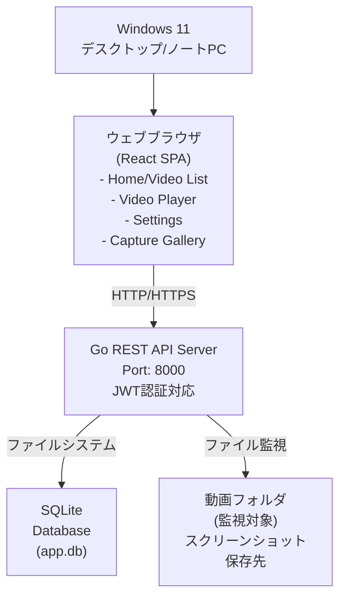
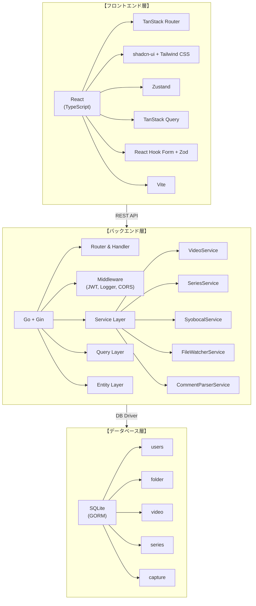
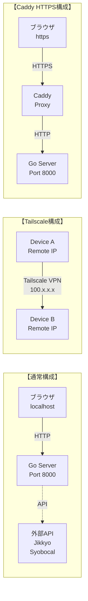
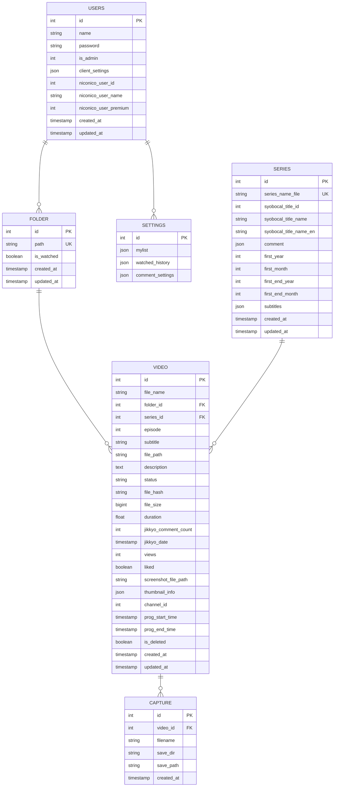

# CommentPlayer 要件定義書

**バージョン**: 1.0  
**作成日**: 2026年4月9日  
**最終更新**: 2026年4月9日

---

## 目次

1. [1. プロジェクト概要](#1-プロジェクト概要)
2. [2. 機能要件](#2-機能要件)
3. [3. 非機能要件](#3-非機能要件)
4. [4. 推奨追加機能](#4-推奨追加機能)
5. [5. 成功基準](#5-成功基準)
6. [6. 参考ドキュメント](#6-参考ドキュメント)

---

## 1. プロジェクト概要

### 1.1 プロジェクト名
CommentPlayer

### 1.2 目的・背景
ローカルに保存されている動画ファイルをブラウザ上で再生し、リアルタイムでコメント（弾幕）を表示するアプリケーション。ニコニコ実況の過去ログやしょぼいカレンダーなどの外部APIを活用して、動画に関連するメタデータやコメント情報を自動取得できる視聴体験を提供する。

### 1.3 ユーザー対象
- アニメ・特撮番組などのコンテンツを視聴・保存している個人ユーザー
- ニコニコ実況でのコメント付き視聴を希望するユーザー
- 複数デバイス間での設定共有を望むユーザー

### 1.4 システムの基本方針
- **アーキテクチャ**: React（TypeScript）フロントエンド + Go（Gin）バックエンド
- **データベース**: SQLite（ローカル開発・本番）
- **デプロイ**: Docker コンテナ対応、Windows環境での動作を優先
- **外部連携**: ニコニコ実況API、しょぼいカレンダーAPI

---

## 2. 機能要件

### 2.1 システム方式

#### 2-1-1 ハードウェア構成図



#### 2-1-2 ソフトウェア構成図



#### 2-1-3 ネットワーク構成図



#### 2-1-4 アプリケーション機能構成図

```
CommentPlayer
├─ 【表示系機能】
│  ├─ Home Screen / Video List
│  │  ├─ 動画検索（タイトル部分一致）
│  │  ├─ フィルタリング（年度、シリーズ別）
│  │  ├─ ソート（ファイル名、放送日）
│  │  ├─ マイリスト管理
│  │  ├─ 視聴履歴表示
│  │  └─ サムネイル表示・再生成
│  │
│  ├─ Video Player
│  │  ├─ 動画再生制御
│  │  ├─ コメント表示（リアルタイム弾幕）
│  │  ├─ コメント検索・フィルタリング
│  │  ├─ メタデータ表示
│  │  └─ シリーズ再生
│  │
│  ├─ Settings Screen
│  │  ├─ フォルダ管理（監視対象設定）
│  │  ├─ コメント表示カスタマイズ
│  │  ├─ NGキーワード設定
│  │  └─ ユーザー認証
│  │
│  └─ Capture Gallery
│     ├─ キャプチャ一覧表示
│     └─ キャプチャ削除
│
├─ 【データ処理系機能】
│  ├─ Video Management
│  │  ├─ ファイル監視（リアルタイム）
│  │  ├─ DB同期
│  │  ├─ サムネイル生成
│  │  └─ メタデータ取得
│  │
│  ├─ Series Management
│  │  ├─ ファイル名解析
│  │  ├─ シリーズ自動判定
│  │  ├─ 外部APIとの連携
│  │  └─ メタデータ同期
│  │
│  ├─ Comment Management
│  │  ├─ XMLコメント解析
│  │  ├─ JSONコメント解析
│  │  ├─ Jikkyo API連携
│  │  └─ コメント時刻計算
│  │
│  └─ User Management
│     ├─ ユーザー登録・ログイン
│     ├─ JWT認証
│     ├─ 設定同期
│     └─ パスワード暗号化
│
└─ 【インフラ系機能】
   ├─ Authentication
   │  ├─ JWT トークン発行
   │  ├─ BCrypt パスワード暗号化
   │  └─ 認証ミドルウェア
   │
   ├─ Logging & Monitoring
   │  ├─ リクエストログ
   │  ├─ エラーログ
   │  └─ 構造化ログ（slog）
   │
   ├─ Internationalization
   │  ├─ 日本語ローカライズ
   │  ├─ エラーメッセージ多言語対応
   │  └─ ロケール自動判定
   │
   └─ Database & Persistence
      ├─ SQLite接続・管理
      ├─ マイグレーション
      ├─ シードデータ
      └─ トランザクション管理
```

---

### 2.2 画面要件

#### 2-2-1 画面一覧

| # | 画面名 | 説明 | 主要機能 |
|---|--------|------|--------|
| 1 | ホーム画面 | アプリケーション起動時の初期表示画面 | ・ユーザー認証<br>・未ログイン時の案内 |
| 2 | 動画一覧画面 | ダッシュボード、全動画表示 | ・検索<br>・フィルタリング<br>・ソート<br>・マイリスト機能<br>・視聴履歴 |
| 3 | 動画詳細・再生画面 | 動画の再生・メタデータ表示 | ・再生制御<br>・コメント表示<br>・シリーズ再生<br>・メタデータ表示<br>・A/B/C位置へのシーク |
| 4 | キャプチャ一覧画面 | スクリーンショット一覧 | ・キャプチャ表示<br>・キャプチャ削除<br>・ダウンロード |
| 5 | 設定画面 | アプリケーション全体の設定 | ・フォルダ管理<br>・コメント設定<br>・シリーズ管理<br>・ユーザー認証 |
| 6 | ログイン画面 | ユーザーログイン | ・ユーザー名入力<br>・パスワード入力<br>・トークン発行 |
| 7 | ユーザー登録画面 | 新規ユーザー登録 | ・ユーザー名入力<br>・パスワード設定<br>・バリデーション |

#### 2-2-2 画面遷移図

```
【認証フロー】
        ┌─────────────────┐
        │  ホーム画面      │
        └────────┬────────┘
                 │
         ┌───────▼────────┐
         │ 未ログイン状態？  │
         └───┬──────────┬──┘
         Yes │          │ No
             │          └─────────────────────┐
     ┌───────▼─────────┐                      │
     │ ログイン画面     │                      │
     └───────┬─────────┘                      │
             │                                │
     ┌───────▼────────┐                      │
     │ 登録？         │                      │
     └───┬────────┬──┘                       │
     Yes │        │ No                       │
        ┌▼─────┐ │                          │
        │登録画面 │ │                          │
        └──┬──┘ │                          │
           └──┬─┘                          │
              │    ┌──────────────────────┘
              │    │
          ┌───▼────▼──────┐
          │ 動画一覧画面    │
          └───┬────────────┘
              │
    ┌─────────┼─────────┐
    │         │         │
┌───▼──┐ ┌───▼──┐ ┌────▼───┐
│再生   │ │検索  │ │ 設定    │
│画面   │ │/編集 │ │ 画面    │
└───┬──┘ └───┬──┘ └────┬───┘
    │        │         │
    └────┬───┴─────────┘
         │
     ┌───▼───────────┐
     │キャプチャ     │
     │一覧画面       │
     └───────────────┘
```

> 詳細なレイアウトは SCREEN_DESIGN.md を参照してください。

---

### 2.3 バッチ処理要件

#### 2-3-1 バッチ処理一覧

| # | 処理名 | トリガー | 頻度 | 説明 |
|---|--------|---------|------|------|
| 1 | ファイル監視 | サーバー起動 | リアルタイム | 監視フォルダの動画ファイル追加・削除を検知、DB同期 |
| 2 | サムネイル生成 | 動画ファイル追加時 | オンデマンド | FFmpeg使用して動画のサムネイル画像を自動生成 |
| 3 | シリーズ自動判定 | 動画ファイル追加時 | オンデマンド | ファイル名パターンマッチングでシリーズを抽出 |
| 4 | Syobocal API連携 | ユーザー手動実行 | オンデマンド | シリーズ名をAPIで検索、メタデータ取得・同期 |
| 5 | Jikkyo API取得 | 動画再生時（フロント） | オンデマンド | 放送日時に基づいてニコニコ実況の過去ログを取得 |
| 6 | DB初期化 | CLI コマンド | 初回設定時 | テーブル作成、スキーママイグレーション |
| 7 | シードデータ挿入 | CLI コマンド | 初回設定時 | テスト用の初期データをDB に挿入 |

#### 2-3-2 ファイル監視バッチ仕様

```
【fsnotify ライブラリを使用した監視】

起動時の処理:
1. DBから監視対象フォルダ一覧を取得
2. 各フォルダをwatcher に登録
3. フォルダ内の既存ファイルをスキャン
   - 新規: 動画レコード作成
   - 削除済み動画を検出: 論理削除マーク

リアルタイム監視:
1. ファイル作成イベント: 
   → 動画ファイルか判定
   → サムネイル生成、シリーズ判定、DB登録

2. ファイル削除イベント:
   → DBから検索
   → 論理削除フラグをセット

3. ファイル変更イベント: 無視
```

#### 2-3-3 サムネイル生成仕様

```
【FFmpeg を使用した自動生成】

トリガー:
- 動画ファイル追加時
- ユーザーが「再生成」ボタンをクリック時

処理フロー:
1. ビデオファイルの情報取得（ffprobe）
2. 中央の フレームをキャプチャ（タイムスタンプ = 動画の中点）
3. 指定サイズにリサイズ（デフォルト: 320x180）
4. JPEG形式で保存
5. ThumbnailInfo を DB に記録

保存先:
${storage.captures_dir}/thumbnails/{videoID}.jpg

設定可能項目:
- 幅（width）
- 高さ（height）
```

---

### 2.4 テーブル・ファイル要件

#### 2-4-1 テーブル関連図（ER図）



#### 2-4-2 テーブル・ファイル一覧

| # | テーブル名 | 説明 | 主要用途 |
|---|-----------|------|--------|
| 1 | users | ユーザー情報 | ユーザー認証、アカウント管理、設定保存 |
| 2 | folder | 監視対象フォルダ | 動画ファイル監視設定、パス管理 |
| 3 | video | 動画メタデータ | 動画情報管理、検索・フィルタリング |
| 4 | series | シリーズ情報 | シリーズ管理、メタデータ連携 |
| 5 | capture | キャプチャデータ | スクリーンショット管理 |

#### 2-4-3 テーブル定義書

**【users テーブル】**

| カラム名 | 型 | NOT NULL | デフォルト | 説明 |
|---------|-----|---------|----------|------|
| id | INTEGER | ✓ | | プライマリキー |
| name | VARCHAR(255) | ✓ | | ユーザー名 |
| password | VARCHAR(255) | ✓ | | パスワード (BCrypt暗号化) |
| is_admin | INTEGER | | 0 | 管理者フラグ (0=一般, 1=管理者) |
| client_settings | JSON | | NULL | クライアント設定 (視聴履歴、マイリスト等) |
| niconico_user_id | INTEGER | | NULL | ニコニコユーザーID |
| niconico_user_name | VARCHAR(255) | | NULL | ニコニコユーザー名 |
| niconico_user_premium | INTEGER | | NULL | プレミアム会員フラグ |
| niconico_access_token | VARCHAR(1024) | | NULL | ニコニコAPIアクセストークン (非公開) |
| niconico_refresh_token | VARCHAR(1024) | | NULL | ニコニコAPIリフレッシュトークン (非公開) |
| created_at | DATETIME | ✓ | CURRENT_TIMESTAMP | 作成日時 |
| updated_at | DATETIME | ✓ | CURRENT_TIMESTAMP | 更新日時 |

**【folder テーブル】**

| カラム名 | 型 | NOT NULL | デフォルト | 説明 |
|---------|-----|---------|----------|------|
| id | INTEGER | ✓ | | プライマリキー |
| path | VARCHAR(1024) | ✓ | | 監視対象フォルダのパス (UNIQUE) |
| is_watched | BOOLEAN | | true | 監視有効フラグ |
| created_at | DATETIME | ✓ | CURRENT_TIMESTAMP | 作成日時 |
| updated_at | DATETIME | ✓ | CURRENT_TIMESTAMP | 更新日時 |

**【video テーブル】**

| カラム名 | 型 | NOT NULL | デフォルト | 説明 |
|---------|-----|---------|----------|------|
| id | INTEGER | ✓ | | プライマリキー |
| file_name | VARCHAR(512) | ✓ | | 動画ファイル名 |
| folder_id | INTEGER | ✓ | | 外部キー (Folder) |
| series_id | INTEGER | | NULL | 外部キー (Series) |
| episode | INTEGER | | NULL | エピソード番号 |
| subtitle | VARCHAR(512) | | NULL | エピソードサブタイトル |
| file_path | VARCHAR(1024) | ✓ | | ファイルの完全パス |
| description | TEXT | | NULL | 説明文 |
| status | VARCHAR(32) | | ready | ステータス (ready/processing/error) |
| file_hash | VARCHAR(64) | | | ファイルハッシュ (SHA256) |
| file_size | BIGINT | | | ファイルサイズ (バイト) |
| duration | FLOAT | | 0.0 | 動画長 (秒) |
| jikkyo_comment_count | INTEGER | | NULL | ニコニコ実況コメント数 |
| jikkyo_date | DATETIME | | NULL | 放送日時 |
| views | INTEGER | | 0 | 再生回数 |
| liked | BOOLEAN | | false | マイリスト登録フラグ |
| screenshot_file_path | VARCHAR(1024) | | NULL | スクリーンショット保存パス |
| thumbnail_info | JSON | | NULL | サムネイル情報 (width, height, generated_at) |
| channel_id | INTEGER | | NULL | Syobocal チャンネルID |
| prog_start_time | DATETIME | | NULL | 放送開始時刻 |
| prog_end_time | DATETIME | | NULL | 放送終了時刻 |
| is_deleted | BOOLEAN | | false | 論理削除フラグ |
| created_at | DATETIME | ✓ | CURRENT_TIMESTAMP | 作成日時 |
| updated_at | DATETIME | ✓ | CURRENT_TIMESTAMP | 更新日時 |

**【series テーブル】**

| カラム名 | 型 | NOT NULL | デフォルト | 説明 |
|---------|-----|---------|----------|------|
| id | INTEGER | ✓ | | プライマリキー |
| series_name_file | VARCHAR(255) | ✓ | | シリーズ名 (ファイル名から抽出) |
| syobocal_title_id | INTEGER | | NULL | Syobocal TitleID |
| syobocal_title_name | VARCHAR(512) | | NULL | Syobocal 日本語タイトル |
| syobocal_title_name_en | VARCHAR(512) | | NULL | Syobocal 英語タイトル |
| comment | JSON | | {} | コメント情報 (構造化データ) |
| first_year | INTEGER | | NULL | 放送開始年 |
| first_month | INTEGER | | NULL | 放送開始月 |
| first_end_year | INTEGER | | NULL | 放送終了年 |
| first_end_month | INTEGER | | NULL | 放送終了月 |
| subtitles | JSON | | [] | サブタイトル一覧 |
| created_at | DATETIME | ✓ | CURRENT_TIMESTAMP | 作成日時 |
| updated_at | DATETIME | ✓ | CURRENT_TIMESTAMP | 更新日時 |

**【capture テーブル】**

| カラム名 | 型 | NOT NULL | デフォルト | 説明 |
|---------|-----|---------|----------|------|
| id | INTEGER | ✓ | | プライマリキー |
| video_id | INTEGER | ✓ | | 外部キー (Video) |
| filename | VARCHAR(255) | ✓ | | キャプチャファイル名 |
| save_dir | VARCHAR(1024) | ✓ | | 保存ディレクトリ |
| save_path | VARCHAR(1024) | ✓ | | 完全保存パス |
| created_at | DATETIME | ✓ | CURRENT_TIMESTAMP | 作成日時 |

---

### 2.5 コメント形式仕様

#### 2-5-1 対応するコメント形式

**【XML形式 (ニコニコ形式)】**

```xml
<?xml version="1.0" encoding="utf-8"?>
<packet>
  <chat
    thread="1234567"
    no="1"
    vpos="1000"
    date="1234567890"
    date_usec="123456"
    owner="0"
    user_id="abc123def"
    mail="184 big red"
  >コメント内容</chat>
  <chat
    thread="1234567"
    no="2"
    vpos="2000"
    ...
  >別のコメント</chat>
</packet>
```

**【JSON形式】**

```json
{
  "packet": [
    {
      "chat": {
        "thread": "1234567",
        "no": "1",
        "vpos": "1000",
        "date": "1234567890",
        "date_usec": "123456",
        "owner": "0",
        "user_id": "abc123def",
        "mail": "184 big red",
        "content": "コメント内容"
      }
    }
  ]
}
```

#### 2-5-2 DPlayer形式への変換仕様

フロントエンド (DPlayer ライブラリ) へ返すJSON形式:

```typescript
interface ApiComment {
  time: number;        // コメント表示時刻（秒）
  type: number;        // コメント種別 (0=通常, 1=top, 2=bottom)
  color: string;       // コメント色 (16進数コード)
  author: string;      // コメント投稿者
  text: string;        // コメント内容
}
```

---

## 3. 非機能要件

### 3.1 可用性

| 項目 | 要件 |
|------|------|
| システム稼働率 | 99% 以上 (予定メンテナンス除く) |
| 応答時間（複数デバイス同時アクセス） | 1秒以内 |
| エラー復旧時間 | 自動再起動対応（Systemd, Docker） |
| バックアップ頻度 | 手動 or 定期スケジュール対応 |

### 3.2 性能・拡張性

| 項目 | 要件 |
|------|------|
| 動画リスト表示 | 1000件以上でも仮想スクロール対応（50ms以内） |
| 検索応答時間 | 100万レコード以上でも500ms以内 |
| コメント表示フレームレート | 60FPS維持 |
| 監視フォルダ数 | 最大 50フォルダ対応 |
| 同一シリーズの動画数 | 最大 500件対応 |
| コメント総数 | 最大 100万件対応 |
| データベースサイズ | 推奨 10GB以下 |

### 3.3 運用・保守性

| 項目 | 要件 |
|------|------|
| ログレベル設定 | DEBUG/INFO/WARN/ERROR 切り替え可能 |
| ログ出力形式 | JSON 構造化ログ対応 |
| エラーハンドリング | 例外発生時も処理継続（グレースフルデグラデーション） |
| 多言語対応 | 日本語・英語の TOML ファイルで管理 |
| ロケール判定 | Accept-Language ヘッダーで自動判定 |
| マイグレーション | GORM AutoMigrate で自動スキーマ更新 |
| CLI コマンド | Cobra フレームワークで管理 |

### 3.4 セキュリティ

| 項目 | 要件 |
|------|------|
| 認証方式 | JWT (HS256) トークンベース認証 |
| パスワード暗号化 | BCrypt (デフォルトコスト: 12) |
| トークン有効期限 | 設定可能 (推奨: 7日～30日) |
| HTTP ヘッダー | CORS 対応、セキュリティヘッダー設定 |
| API エンドポイント | 認証不要エンドポイント最小化 |
| SQL インジェクション対策 | GORM プリペアドステートメント |
| HTTPS 対応 | Caddy リバースプロキシで実装 |
| パスワード要件 | 最小 8 文字（複雑性要件なし） |
| セッション管理 | ステートレス JWT 方式 |

### 3.5 システム環境・エコロジー

| 項目 | 要件 |
|------|------|
| OS | Windows 10/11 (PowerShell 7.x) |
| ブラウザ | Chrome/Edge 最新版推奨 |
| メモリ | 最小 2GB (推奨 4GB以上) |
| ストレージ | 最小 500MB (DB + キャッシュ) |
| ネットワーク | インターネット接続 (API利用時) |
| Docker対応 | 開発・本番環境で Docker Compose 利用可 |
| リソース効率 | CPU 使用率 10～20%, メモリ 300~500MB |

---

## 4. 画面要件詳細

### 4.1 レスポンシブ設計

- **デスクトップ**: 1920x1080 以上
- **タブレット**: 768px 以上
- **モバイル**: 375px 以上 (将来対応)

### 4.2 アクセシビリティ

- WCAG 2.1 Level AA 準拠を目指す
- キーボード操作対応 (Tab キー、Enter キー)
- スクリーンリーダー対応 (ARIA ラベル)

### 4.3 プログレッシブエンハンスメント

- JavaScript 無効化時は警告表示
- APIエラー時のフォールバック処理
- オフライン状態の検知・通知

---

## 5. データベース要件

### 5.1 バックアップ・リカバリ

```yaml
バックアップ方式:
  - SQLiteファイルのコピー
  - 頻度: 日次 (自動 or 手動)
  - 保持期間: 最新 7世代まで

リカバリ手順:
  1. サーバー停止
  2. app.db をバックアップ
  3. 復旧ファイルを app.db に置き換え
  4. サーバー起動
```

### 5.2 マイグレーション管理

GORM の AutoMigrate を使用:
```go
db.AutoMigrate(
    &entity.Video{},
    &entity.Folder{},
    &entity.Series{},
    &entity.User{},
    &entity.Capture{},
)
```

---

## 6. 外部インターフェース要件

### 6.1 外部システム関連図

```
CommentPlayer
    │
    ├─► ニコニコ実況 API
    │   └─ 過去ログコメント取得
    │      (URL: https://jikkyo.tsukumijima.net/)
    │
    ├─► しょぼいカレンダー API
    │   └─ 番組情報取得
    │      (URL: http://cal.syoboi.jp/)
    │
    ├─► FFmpeg / FFprobe
    │   └─ ビデオ処理（サムネイル、メタデータ）
    │
    └─► ファイルシステム
        ├─ 動画ファイル監視 (fsnotify)
        └─ キャプチャ保存
```

> 詳細なAPI仕様は API_SPECIFICATION.md を参照してください。

---

## 7. 推奨追加機能

プロダクト化に向けて、以下の追加機能の実装を推奨します。

### 7.1 動画プレイリスト管理

```
【概要】
複数の動画をプレイリストにまとめて、順序指定で連続再生

【主要機能】
- プレイリスト作成・編集・削除
- 動画の順序変更（ドラッグ&ドロップ）
- プレイリストの共有 (ユーザー間)
- 自動再生ON/OFF
- シャッフル再生
```

### 7.2 高度なコメント検索・フィルタ

```
【概能】
コメントを高度に検索・フィルタリング

【主要機能】
- 正規表現検索
- ユーザー名フィルタ
- 日時範囲フィルタ
- コメント数の集計・グラフ表示
- 頻出キーワード抽出
```

### 7.3 複数デバイス間での視聴同期

```
【概要】
複数デバイスでの再生位置・設定の同期

【主要機能】
- リアルタイム同期 (WebSocket)
- 離席状態の検知
- 同期キューの管理
```

### 7.4 オフライン再生対応

```
【概要】
インターネット接続なしで動画再生

【主要機能】
- 動画のオフラインキャッシュ
- コメントのプリロード
- キャッシュ容量管理
```

### 7.5 統計・分析ダッシュボード

```
【概要】
視聴統計、コメント分析を可視化

【主要機能】
- 視聴回数ランキング
- 視聴時間の集計
- コメント数の推移グラフ
- 週間・月間のサマリー
```

### 7.6 SNS連携

```
【概要】
ニコニコ動画、Twitter等との連携

【主要機能】
- ニコニコ動画への投稿連携
- Twitter へのシェア
- フォロワー機能
```

---

## 8. 成功基準

### 8.1 機能完成度

- [x] 基本的な動画再生機能
- [x] コメント表示（XML/JSON対応）
- [x] ニコニコ実況API連携
- [x] ファイルシステム監視
- [x] ユーザー認証・JWT
- [x] マイリスト・視聴履歴機能
- [ ] オフライン再生対応
- [ ] 複数デバイス同期
- [ ] SNS連携

### 8.2 パフォーマンス基準

| 指標 | 目標値 | 達成状況 |
|------|--------|--------|
| 動画リスト表示 | <100ms | ? |
| 検索応答時間 | <500ms | ? |
| コメント表示フレームレート | 60FPS | ? |
| API レスポンス | <200ms | ? |

### 8.3 品質基準

| 項目 | 目標値 |
|------|--------|
| テストカバレッジ | 70%以上 |
| ユニットテスト数 | 100+件 |
| E2Eテスト | 主要フロー確認 |
| バグ（Critical） | 0件 |
| バグ（High） | 5件以下 |

### 8.4 セキュリティ基準

- [ ] OWASP Top 10 対応
- [ ] セキュリティヘッダー設定
- [ ] SSL/TLS対応 (HTTPS)
- [ ] パスワード暗号化確認
- [ ] JWT署名確認
- [ ] SQL インジェクション対策確認

### 8.5 ドキュメント完成度

- [x] 要件定義書
- [ ] API仕様書 (OpenAPI 3.0)
- [ ] 設計書（アーキテクチャ、データベース）
- [ ] インストール・セットアップガイド
- [ ] ユーザーマニュアル
- [ ] 開発者向けドキュメント
- [ ] トラブルシューティングガイド

---

## 付録

### A. 用語集

| 用語 | 説明 |
|------|------|
| VPos | ビデオ位置。ニコニコ形式では 100ms 単位のタイムスタンプ |
| Jikkyo | ニコニコ実況。テレビ放送をリアルタイム視聴中のコメント |
| Syobocal | しょぼいカレンダー。テレビ番組の放送予定・情報データベース |
| チャンネルID (ChID) | Syobocal で定義されたテレビチャンネルの一意識別子 |
| TID | Syobocal における作品（タイトル）の一意識別子 |
| JWT | JSON Web Token。ステートレス認証に使用 |
| SPA | Single Page Application。React で構成されるフロント |

### B. 参考リンク

- [ニコニコ実況 API](https://jikkyo.tsukumijima.net/)
- [しょぼいカレンダー API](http://cal.syoboi.jp/)
- [GORM ドキュメント](https://gorm.io/)
- [Gin Web Framework](https://gin-gonic.com/)
- [React Documentation](https://react.dev/)

---

**修訂履歴**

| 版 | 日付 | 変更内容 |
|---|------|--------|
| 1.0 | 2026-04-09 | 初版作成 |


