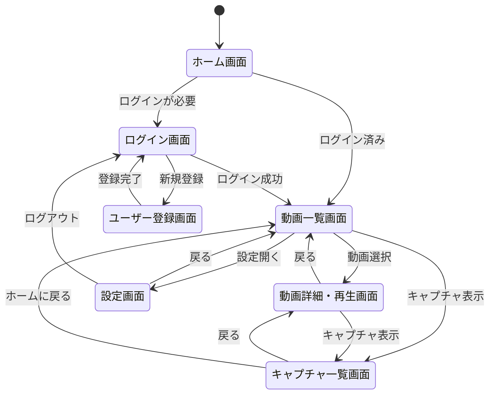
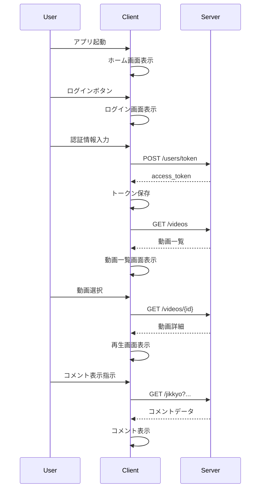
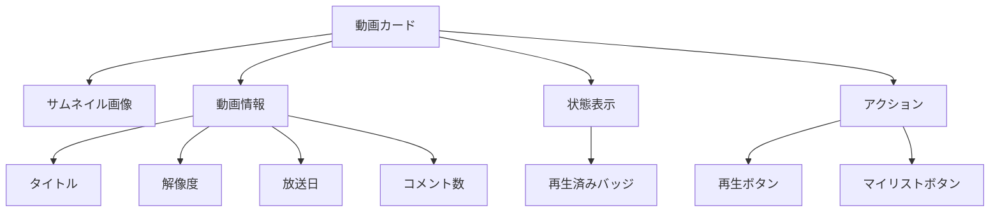

# CommentPlayer 画面設計書

**バージョン**: 1.0  
**作成日**: 2026年4月9日

---

## 目次

1. [画面一覧](#画面一覧)
2. [画面遷移図](#画面遷移図)
3. [画面詳細](#画面詳細)

---

## 画面一覧

| # | 画面ID | 画面名 | 説明 |
|---|--------|--------|------|
| 1 | SCR001 | ホーム画面 | アプリケーション起動時の初期表示画面 |
| 2 | SCR002 | ログイン画面 | ユーザーログイン画面 |
| 3 | SCR003 | ユーザー登録画面 | 新規ユーザー登録画面 |
| 4 | SCR004 | 動画一覧画面 | 全動画の一覧表示画面 |
| 5 | SCR005 | 動画詳細・再生画面 | 動画の再生とメタデータ表示 |
| 6 | SCR006 | キャプチャ一覧画面 | スクリーンショット一覧表示 |
| 7 | SCR007 | 設定画面 | アプリケーション全体の設定 |

---

## 画面遷移図

### 全体フロー



### 詳細遷移図（シーケンス）



---

## 画面詳細

### SCR001: ホーム画面

**説明**: アプリケーション起動時に表示される初期画面。ユーザーの認証状態を判定し、次の画面へ遷移。

**レイアウト:**
```
┌─────────────────────────────────────┐
│         CommentPlayer               │
│                                     │
│      ローカル動画視聴プレイヤー      │
│                                     │
│  ┌─────────────────────────────┐  │
│  │  ログイン       新規登録       │  │
│  │  [ボタン]      [ボタン]      │  │
│  └─────────────────────────────┘  │
│                                     │
│  ※ ログイン済みの場合は             │
│     自動的に動画一覧画面へ遷移      │
└─────────────────────────────────────┘
```

**主要要素:**
- CommentPlayerロゴ
- ログインボタン
- 新規登録ボタン

---

### SCR002: ログイン画面

**説明**: ユーザーがユーザー名とパスワードを入力してログインする画面。

**レイアウト:**
```
┌─────────────────────────────────────┐
│  CommentPlayer            ◀ 戻る    │
├─────────────────────────────────────┤
│                                     │
│         ログイン                    │
│                                     │
│  ユーザー名:                        │
│  [________________]                 │
│                                     │
│  パスワード:                        │
│  [________________]                 │
│                                     │
│  ┌─────────────────────────────┐  │
│  │  ログイン [ボタン]           │  │
│  └─────────────────────────────┘  │
│                                     │
│  新規登録は [こちら]                │
│                                     │
└─────────────────────────────────────┘
```

**入力フィールド:**
- ユーザー名（必須）
- パスワード（必須）

**ボタン:**
- ログイン
- 新規登録へ

**バリデーション:**
- ユーザー名: 1文字以上
- パスワード: 8文字以上

---

### SCR003: ユーザー登録画面

**説明**: 新規ユーザー登録画面。ユーザー名とパスワードを入力して登録。

**レイアウト:**
```
┌─────────────────────────────────────┐
│  CommentPlayer            ◀ 戻る    │
├─────────────────────────────────────┤
│                                     │
│       新規ユーザー登録              │
│                                     │
│  ユーザー名:                        │
│  [________________]                 │
│  ※ 1文字以上                       │
│                                     │
│  パスワード:                        │
│  [________________]                 │
│  ※ 8文字以上                       │
│                                     │
│  パスワード確認:                    │
│  [________________]                 │
│                                     │
│  ┌─────────────────────────────┐  │
│  │  登録 [ボタン]               │  │
│  └─────────────────────────────┘  │
│                                     │
└─────────────────────────────────────┘
```

**入力フィールド:**
- ユーザー名（必須）
- パスワード（必須）
- パスワード確認（必須）

**バリデーション:**
- ユーザー名: 1文字以上
- パスワード: 8文字以上
- パスワード一致確認

---

### SCR004: 動画一覧画面

**説明**: 登録されている全動画を一覧表示。検索、フィルタリング、ソート機能を備える。

**レイアウト:**
```
┌─────────────────────────────────────────┐
│  CommentPlayer                    [⚙]  │ ロゴ、設定ボタン
├─────────────────────────────────────────┤
│ 検索: [_______] [フィルタ▼][ソート▼]  │ 検索・フィルタ・ソート
├─────────────────────────────────────────┤
│                                         │
│  ┌─────────────────────────────────┐  │
│  │[📷] タイトル1          再生済   │  │ 動画カード
│  │ 1920x1080  2024-01-15          │  │
│  │ コメント: 5000件               │  │
│  └─────────────────────────────────┘  │
│                                         │
│  ┌─────────────────────────────────┐  │
│  │[📷] タイトル2                   │  │
│  │ 1280x720   2024-01-20           │  │
│  │ コメント: 3000件               │  │
│  └─────────────────────────────────┘  │
│                                         │
│  ... (仮想スクロール)                 │
│                                         │
├─────────────────────────────────────────┤
│  ◀ 1 2 3 4 5 ▶  (ページネーション)    │
└─────────────────────────────────────────┘
```

**主要要素:**
- 検索バー
- フィルタドロップダウン
- ソートドロップダウン
- 動画カード（サムネイル、タイトル、放送日等）
- ページネーション

**機能:**
- キーワード検索
- 年でフィルタリング
- ファイル名/放送日でソート
- マイリスト追加
- 再生履歴表示

---

### SCR005: 動画詳細・再生画面

**説明**: 動画を再生し、コメントを表示。メタデータを確認できる。

**レイアウト:**
```
┌──────────────────────────────────────────┐
│ ◀ 戻る                                    │
├──────────────────────────────────────────┤
│                                          │
│  ┌──────────────────────────────────┐  │
│  │                                  │  │
│  │     [動画再生領域]                │  │
│  │  (コメント弾幕が重ねられる)      │  │
│  │                                  │  │
│  │                                  │  │
│  └──────────────────────────────────┘  │
│                                          │
│ [■◀◀|▶▶■]  00:23 / 25:30               │ コントローラ
│ [🔊] [||] [⛶]                           │
├──────────────────────────────────────────┤
│ タイトル: xxxxx                        │
│ 再生数: 123  マイリスト: ☆           │
├──────────────────────────────────────────┤
│ 【タブ】 コメント | メタデータ | シリーズ│
├──────────────────────────────────────────┤
│ 【コメント検索】                        │
│ [検索__________] [A位置] [B位置]       │
│ [C位置] [遅延: +0s ▼]                  │
├──────────────────────────────────────────┤
│ コメント一覧 (スクロール可)             │
│ 00:30 | user1: コメント内容...       │
│ 00:31 | user2: コメント内容...       │
│ ...                                  │
└──────────────────────────────────────────┘
```

**主要要素:**
- 動画プレイヤー
- コメント表示（重ねる）
- コントローラ（再生、音量、フルスクリーン）
- メタデータ表示タブ
- コメント検索
- コメント一覧

**機能:**
- 再生/一時停止
- シーク操作
- 音量調整
- フルスクリーン
- A/B/C位置へのシーク
- コメント表示/非表示
- コメント遅延調整

---

### SCR006: キャプチャ一覧画面

**説明**: 撮影したスクリーンショットを一覧表示。

**レイアウト:**
```
┌──────────────────────────────────────┐
│  キャプチャ一覧          [×閉じる] │
├──────────────────────────────────────┤
│                                      │
│  ┌──────────────────────────────┐  │
│  │[キャプチャ画像]    │[×削除]   │  │
│  │ 00:30  2024-01-15  │          │  │
│  └──────────────────────────────┘  │
│                                      │
│  ┌──────────────────────────────┐  │
│  │[キャプチャ画像]    │[×削除]   │  │
│  │ 01:15  2024-01-15  │          │  │
│  └──────────────────────────────┘  │
│                                      │
│  ... (スクロール)                    │
│                                      │
└──────────────────────────────────────┘
```

**主要要素:**
- キャプチャサムネイル
- 撮影時刻
- 削除ボタン

---

### SCR007: 設定画面

**説明**: アプリケーション全体の設定。フォルダ管理、コメント表示カスタマイズなど。

**レイアウト:**
```
┌────────────────────────────────────┐
│  設定                        [×閉じる]│
├────────────────────────────────────┤
│ 【フォルダ管理】                    │
│ ┌──────────────────────────────┐  │
│ │C:\Videos\Anime   [×削除]    │  │
│ │C:\Videos\Series  [×削除]    │  │
│ └──────────────────────────────┘  │
│ [+ フォルダ追加]                   │
│                                    │
│ 【コメント表示設定】                │
│ 最大表示数: [20▼]                  │
│ コメント色: [■赤色]                │
│ フォントサイズ: [100%▼]            │
│                                    │
│ 【NGキーワード】                    │
│ [新規追加____] [追加ボタン]        │
│ ・spam       [×]                  │
│ ・test       [×]                  │
│                                    │
│ 【ユーザー設定】                    │
│ アカウント: user123                │
│ [ログアウト]                       │
│                                    │
└────────────────────────────────────┘
```

**セクション:**
- **フォルダ管理**: 監視対象フォルダの追加・削除
- **コメント表示設定**: 最大表示数、色、サイズ調整
- **NGキーワード**: フィルタリングキーワード管理
- **ユーザー設定**: ログアウト

---

## 画面要素の詳細仕様

### 動画カード



### コメント表示フォーマット

```
[時刻] | [ユーザー名] : [コメント内容]
例)
00:30 | user123: このシーンいいね！
```

---

**修訂履歴**

| 版 | 日付 | 変更内容 |
|---|------|--------|
| 1.0 | 2026-04-09 | 初版作成 |
